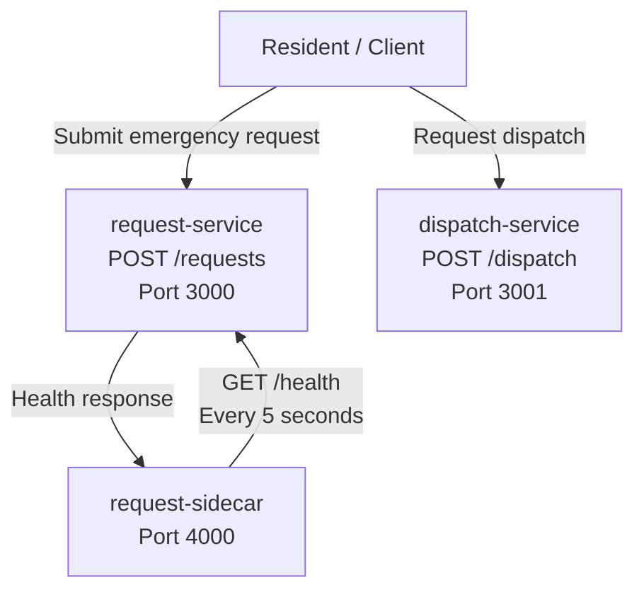

# Initial Service List

## api-gateway-service: - Serves as the single entry point for all client requests.
- Routes requests to the appropriate backend service.
- Handles authentication, authorization, rate limiting, and request validation.
## request-service: - Accepts and manages emergency assistance requests.
- Tracks request status (submitted, assigned, in progress, completed).
- Stores request details, including location, urgency, and resource needs.
## volunteer-service: - Manages volunteer accounts and availability.
- Matches volunteers with assistance requests based on location and skills.
- Updates volunteer assignments and completion status.
## dispatch-service: - Coordinates emergency response and resource allocation.
- Assigns requests to volunteers, shelters, or emergency responders.
- Prioritizes high-urgency requests and sends notifications when assignments are made.

# Community Emergency Resource Coordination System

## Sprint 2 Services

This sprint introduces the first containerized services for the Community Emergency Resource Coordination System. The system simulates how emergency assistance requests can be submitted and how those requests can be assigned to emergency response teams during a large-scale disaster.

The system currently consists of three containers:

- **request-service** — Accepts emergency assistance requests and returns simulated request data.
- **dispatch-service** — Simulates assigning emergency response teams or resources to assistance requests.
- **request-sidecar** — Runs alongside the request service and periodically checks its health to monitor whether the service is available.

## System Diagram



## Service Connections

The services run as separate containers using Docker Compose.

The **request-service** accepts emergency assistance requests through the `POST /requests` endpoint. It returns simulated domain-specific information including a request ID, resident ID, location, urgency, requested assistance, status, and creation timestamp. The service also adds approximately 200 milliseconds of simulated latency to represent the delay that could occur when processing a request in a real distributed system.

The **dispatch-service** accepts dispatch requests through the `POST /dispatch` endpoint. It returns simulated information about the dispatch assignment, including the dispatch ID, request ID, assigned response team, priority, assignment status, and estimated arrival time.

The **request-sidecar** is a separate container that runs alongside the request service. Every five seconds, it sends a health check request to the request service using the Docker Compose service name `request-service`. The sidecar logs whether the request service is available. This demonstrates the sidecar pattern by moving monitoring functionality into a separate container rather than placing the monitoring logic directly inside the primary request service.

## Sidecar Pattern

The request-sidecar uses the **sidecar pattern** because it provides monitoring functionality alongside the primary request service without requiring the request service itself to contain the monitoring logic.

The relationship is:

```text
request-service
      ▲
      │
      │ GET /health
      │
request-sidecar
```

The sidecar communicates with the request service over the Docker Compose network using:

```text
http://request-service:3000/health
```

Docker Compose provides service discovery, allowing the sidecar to communicate with `request-service` using its service name instead of relying on a hard-coded container IP address.

If the request service is healthy, the sidecar produces an observable log message:

```text
[SIDECAR] request-service heartbeat OK
```

If the request service is unavailable, the sidecar reports that the service is unavailable.

This pattern is useful for the emergency resource coordination system because monitoring is important during disasters, when service availability is critical. Keeping monitoring in a separate sidecar allows the primary request service to focus on processing emergency requests while the sidecar independently monitors service health.

## Docker Compose Architecture

All Sprint 2 services are started together using Docker Compose:

```bash
docker compose up
```

The current services are:

| Service          | Purpose                                 | Container Port |
| ---------------- | --------------------------------------- | -------------: |
| request-service  | Processes emergency assistance requests |           3000 |
| dispatch-service | Assigns emergency response resources    |           3001 |
| request-sidecar  | Monitors request-service health         |           4000 |

The sidecar is exposed on host port `4003` for testing, while the request service and dispatch service are exposed on host ports `3000` and `3001`.

The request-sidecar depends on the request-service health check before starting. This ensures that the primary service is healthy before the monitoring sidecar begins its normal operation.

## Sprint 2 Scope

The current system is a simulation and does not connect to real emergency databases, external APIs, or user data. The services return synthetic data that represents the behavior of the planned distributed system.

Future sprints will expand the architecture with additional services and distributed-system patterns to support the complete community emergency resource coordination workflow.

```text
Community Emergency Resource Coordination System

                                  Client / Resident
                                         |
                                         |
                                         v
                              +---------------------+
                              |   request-service   |
                              |                     |
                              | POST /requests      |
                              | Emergency Requests |
                              +---------------------+
                                         ^
                                         |
                                  monitors health
                                         |
                              +---------------------+
                              |  request-sidecar    |
                              |                     |
                              | Health Monitoring   |
                              | Heartbeat Logging   |
                              +---------------------+


                                  Client / System
                                         |
                                         v
                              +---------------------+
                              |  dispatch-service   |
                              |                     |
                              | POST /dispatch      |
                              | Resource Assignment |
                              +---------------------+
```

# Services Architecture

```mermaid
flowchart TD

    Client[Residents / Responders]

    Client --> Gateway[API Gateway]


    Gateway --> Caddy[Caddy Load Balancer]


    Caddy --> Volunteer1[Volunteer Service Replica 1]
    Caddy --> Volunteer2[Volunteer Service Replica 2]
    Caddy --> Volunteer3[Volunteer Service Replica 3]


    Volunteer1 --> Redis[(Redis Cache)]
    Volunteer2 --> Redis
    Volunteer3 --> Redis


    Volunteer1 --> Database[(Database)]
    Volunteer2 --> Database
    Volunteer3 --> Database


    Gateway --> Dispatch[Dispatch Service]

    Dispatch --> Shelter[Shelter Service]

    Dispatch --> FoodBank[Food Bank Service]

    Dispatch --> Healthcare[Healthcare Service]


    Volunteer1 --> Sidecar[Volunteer Sidecar]

Meaning:

- **Caddy** = load balancer
- **Replicas** = multiple copies of the same service
- **Redis** = caching layer

---
