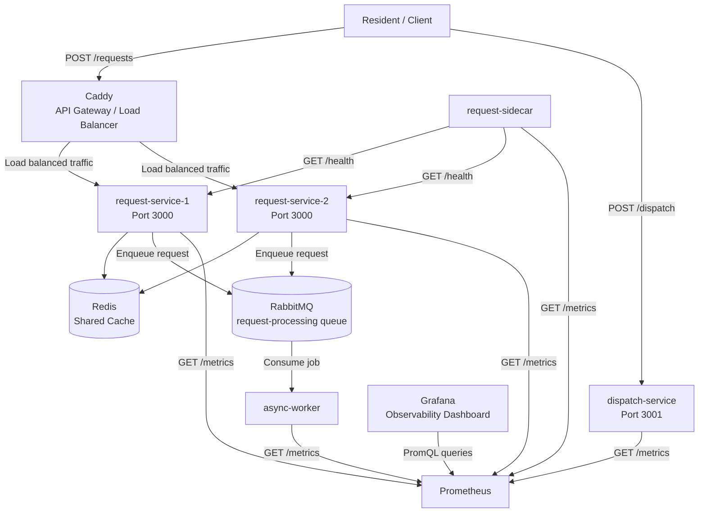

# Community Emergency Resource Coordination System

## Overview

The Community Emergency Resource Coordination System is a distributed system that simulates how emergency assistance requests can be submitted, processed, and coordinated during large-scale emergencies.

The final system uses multiple containerized services and distributed-system patterns developed across five sprints. These include service replication, load balancing, caching, asynchronous processing, health monitoring, structured logging, and metrics-based observability with Prometheus and Grafana.

The complete system is managed with Docker Compose and can be started with:

```bash
docker compose up --build
```

---

## Final System Architecture



There are two primary client-facing paths:

1. **Request path:** The client sends `POST /requests` to Caddy, which load balances the request across the two request-service replicas.
2. **Dispatch path:** The client sends `POST /dispatch` directly to the dispatch-service.

The request-service replicas share Redis for caching and RabbitMQ for asynchronous processing. The request-sidecar independently monitors the health of both request-service replicas.

Prometheus collects metrics from the custom services, and Grafana queries Prometheus to display the observability dashboard.

---

## Services

### Caddy API Gateway / Load Balancer

**Container:** `caddy`

Caddy serves as the public entry point for the primary emergency request path. It receives incoming HTTP requests and distributes traffic across the two request-service replicas.

The primary request endpoint is:

```text
POST http://localhost:8080/requests
```

Caddy communicates with the request-service containers through the Docker Compose network.

The request path is:

```text
Client
  |
  v
Caddy
  |
  +--------------------+
  |                    |
  v                    v
request-service-1   request-service-2
```

This allows the system to use a single client-facing endpoint while distributing requests across multiple application instances.

---

### request-service-1 and request-service-2

**Containers:** `request-service-1`, `request-service-2`

The request-service accepts emergency assistance requests through:

```text
POST /requests
```

It also exposes:

```text
GET /health
GET /metrics
```

The service returns simulated emergency request information including:

- request ID
- resident ID
- location
- urgency
- requested assistance
- status
- creation timestamp

The two request-service containers provide service replication and horizontal scaling.

Both replicas communicate with the same Redis cache and RabbitMQ message broker.

The replicas intentionally use different simulated fault-delay configurations:

```text
request-service-1:
  FAULT_DELAY_MS=5000

request-service-2:
  FAULT_DELAY_MS=0
```

This configuration supports resilience and failure testing by allowing the two replicas to exhibit different response behavior.

Both services use:

```text
RABBITMQ_URL=amqp://rabbitmq:5672
```

to connect to RabbitMQ through the Docker Compose network.

---

### Redis

**Container:** `redis`

Redis provides shared caching for the request-service replicas.

Both request-service instances communicate with the same Redis container:

```text
request-service-1 ──┐
                    ├──> Redis
request-service-2 ──┘
```

Using a shared cache allows cached information to remain available regardless of which request-service replica receives a request.

Redis uses a Docker health check based on `redis-cli ping`. The request-service replicas wait for Redis to become healthy before starting.

---

### RabbitMQ

**Container:** `rabbitmq`

RabbitMQ provides the asynchronous messaging layer for request processing.

The request-service places background processing jobs onto the:

```text
request-processing
```

queue.

The asynchronous flow is:

```text
request-service
      |
      | enqueue job
      v
   RabbitMQ
      |
      | consume job
      v
 async-worker
```

This separates background processing from the synchronous HTTP request path.

RabbitMQ uses a Docker health check, and both the request-service replicas and async-worker wait for RabbitMQ to become healthy before starting.

---

### async-worker

**Container:** `async-worker`

The async-worker consumes jobs from the RabbitMQ `request-processing` queue.

The worker processes jobs independently from the HTTP request path and acknowledges completed messages.

The asynchronous architecture allows the request-service to return a `202 Accepted` response after successfully enqueueing the request rather than waiting for background processing to finish.

The worker connects to RabbitMQ using:

```text
RABBITMQ_URL=amqp://rabbitmq:5672
```

The async-worker also provides:

```text
GET /health
GET /metrics
```

and has a Docker health check configured for its health endpoint.

---

### dispatch-service

**Container:** `dispatch-service`

The dispatch-service handles simulated emergency resource dispatch requests through:

```text
POST /dispatch
```

It also provides:

```text
GET /health
GET /metrics
```

The service returns simulated dispatch information such as:

- dispatch ID
- request ID
- assigned response team
- priority
- assignment status
- estimated arrival time

The dispatch-service operates independently from Caddy and the request-service. The client accesses it directly through its own endpoint.

This demonstrates separation of responsibilities between emergency request submission and resource dispatch.

---

### request-sidecar

**Container:** `request-sidecar`

The request-sidecar provides health monitoring for both request-service replicas.

It periodically sends health-check requests to:

```text
GET /health
```

on:

```text
request-service-1
request-service-2
```

The sidecar runs independently from the request-service applications and reports service availability through structured logs.

This demonstrates the **sidecar pattern**, where supporting functionality such as monitoring is separated from the primary application.

The sidecar depends on both request-service replicas becoming healthy before it starts:

```text
request-service-1 ──> healthy ──┐
                                ├──> request-sidecar
request-service-2 ──> healthy ──┘
```

The sidecar uses container port `4000` and is exposed on host port `4003`.

---

## Distributed-System Patterns

The final system demonstrates the major distributed-system patterns developed throughout the project.

### Service Replication

The request-service runs as two independent containers:

```text
request-service-1
request-service-2
```

Replication allows incoming requests to be distributed across multiple application instances instead of relying on a single server.

This improves scalability and provides redundancy.

### Load Balancing

Caddy distributes incoming request traffic across the two request-service replicas:

```text
                    Caddy
                   /     \
                  /       \
                 v         v
          Request 1    Request 2
```

The client only needs to communicate with Caddy while Caddy handles backend request distribution.

### Caching

Redis provides shared caching for both request-service replicas.

Because both replicas use the same Redis instance, cached data is available regardless of which replica handles a request.

### Asynchronous Processing

RabbitMQ and the async-worker provide an asynchronous processing path:

```text
HTTP Request
     |
     v
request-service
     |
     +----> RabbitMQ ----> async-worker
     |
     v
202 Accepted
```

The client-facing request does not need to wait for the background worker to finish processing.

This keeps the synchronous request path responsive while moving longer-running work into the asynchronous processing layer.

### Sidecar Pattern

The request-sidecar runs independently from the request-service and monitors both replicas:

```text
                 +---------------------+
                 | request-service-1   |
                 +---------------------+
                           ^
                           |
                        /health
                           |
                 +---------------------+
                 | request-sidecar     |
                 +---------------------+
                           |
                        /health
                           v
                 +---------------------+
                 | request-service-2   |
                 +---------------------+
```

The sidecar separates health-monitoring responsibilities from the main application logic.

### Health Checks

Docker Compose health checks are used throughout the system to verify service availability.

The request-service replicas expose:

```text
GET /health
```

and depend on healthy Redis and RabbitMQ instances.

The request-sidecar and Caddy depend on both request-service replicas becoming healthy.

RabbitMQ and Redis also provide their own container-level health checks.

This creates a startup dependency chain that helps prevent services from attempting to use dependencies before those dependencies are ready.

---

## Observability Architecture

The final system includes Prometheus metrics, a Grafana dashboard, and structured JSON logging.

### Prometheus Metrics

The custom services expose a Prometheus-compatible metrics endpoint:

```text
GET /metrics
```

The application metrics include:

```text
http_requests_total
http_response_duration_ms
```

`http_requests_total` is a counter that tracks the number of HTTP requests.

`http_response_duration_ms` is a histogram that tracks HTTP response duration in milliseconds.

The services also expose standard Node.js process metrics provided by `prom-client`.

Prometheus periodically scrapes the `/metrics` endpoints from the custom services.

### Monitoring Flow

The observability architecture is:

```text
request-service-1 ──┐
request-service-2 ──┤
dispatch-service ───┤
request-sidecar ────┤
async-worker ───────┘
          |
          | /metrics
          v
     Prometheus
          |
          | PromQL
          v
       Grafana
```

The request-sidecar continues to perform health monitoring independently while also exposing its own metrics to Prometheus.

Grafana uses Prometheus as its data source and displays the collected metrics in the project's observability dashboard.

### Grafana Dashboard

Grafana is automatically provisioned with the project's Prometheus data source and dashboard.

The dashboard displays:

1. **Request Rate** — the rate of HTTP requests.
2. **Error Rate** — the percentage of requests returning non-2xx responses.
3. **P95 Latency** — the 95th percentile response latency.

The dashboard export is committed to:

```text
grafana/provisioning/dashboards/system-overview.json
```

Grafana is available at:

```text
http://localhost:3002
```

Prometheus is available at:

```text
http://localhost:9090
```

---

## Structured Logging

The custom services emit structured JSON logs.

Each log entry contains, at minimum:

- timestamp
- level
- message

HTTP request log entries additionally contain:

- method
- path
- status code
- response time

Structured logging makes service behavior easier to inspect and process automatically.

The request-sidecar also emits structured JSON logs describing the health of the request-service replicas.

---

## Service Endpoints

| Service          | Endpoint                         | Purpose                             |
| ---------------- | -------------------------------- | ----------------------------------- |
| Caddy            | `http://localhost:8080/requests` | Load-balanced request submission    |
| request-service  | `POST /requests`                 | Submit emergency assistance request |
| request-service  | `GET /health`                    | Health check                        |
| request-service  | `GET /metrics`                   | Prometheus metrics                  |
| dispatch-service | `POST /dispatch`                 | Submit dispatch request             |
| dispatch-service | `GET /health`                    | Health check                        |
| dispatch-service | `GET /metrics`                   | Prometheus metrics                  |
| request-sidecar  | `GET /health`                    | Sidecar health check                |
| request-sidecar  | `GET /metrics`                   | Prometheus metrics                  |
| async-worker     | `GET /health`                    | Worker health check                 |
| async-worker     | `GET /metrics`                   | Prometheus metrics                  |
| Prometheus       | `http://localhost:9090`          | Metrics collection and querying     |
| Grafana          | `http://localhost:3002`          | Observability dashboard             |

The request-service replicas are accessed through Caddy rather than directly from the host.

The request-sidecar is exposed on host port `4003`.

The dispatch-service is a separate client-facing service and is accessed independently from the Caddy request path.

---

## Docker Compose Architecture

All application services and infrastructure components are managed through Docker Compose.

The final system includes:

| Container           | Role                              |
| ------------------- | --------------------------------- |
| `caddy`             | API gateway and load balancer     |
| `request-service-1` | Request-service replica 1         |
| `request-service-2` | Request-service replica 2         |
| `dispatch-service`  | Emergency dispatch service        |
| `request-sidecar`   | Request-service health monitoring |
| `async-worker`      | RabbitMQ background worker        |
| `rabbitmq`          | Asynchronous message broker       |
| `redis`             | Shared cache                      |
| `prometheus`        | Metrics collection                |
| `grafana`           | Metrics dashboard                 |

The complete system can be started with:

```bash
docker compose up --build
```

For background execution:

```bash
docker compose up --build -d
```

Container status can be checked with:

```bash
docker compose ps
```

The system can be stopped with:

```bash
docker compose down
```

---

## Environment Variables

The Docker Compose configuration provides the environment variables required by the application services. No `.env` file or manual environment-variable configuration is required for the standard setup.

| Variable         | Services                                           | Working Value          | Purpose                               |
| ---------------- | -------------------------------------------------- | ---------------------- | ------------------------------------- |
| `RABBITMQ_URL`   | request-service-1, request-service-2, async-worker | `amqp://rabbitmq:5672` | Specifies the RabbitMQ connection URL |
| `FAULT_DELAY_MS` | request-service-1, request-service-2               | `5000` or `0`          | Controls the simulated request delay  |

The two request-service replicas intentionally use different `FAULT_DELAY_MS` values:

```text
request-service-1:
  RABBITMQ_URL=amqp://rabbitmq:5672
  FAULT_DELAY_MS=5000

request-service-2:
  RABBITMQ_URL=amqp://rabbitmq:5672
  FAULT_DELAY_MS=0
```

The async-worker uses:

```text
RABBITMQ_URL=amqp://rabbitmq:5672
```

`RABBITMQ_URL` must point to the RabbitMQ service on the Docker Compose network. If it is missing or invalid, the request-service or async-worker cannot connect to RabbitMQ, and asynchronous processing will not work correctly.

`FAULT_DELAY_MS` controls the simulated request delay. A value of `0` means no additional simulated delay, while `5000` adds a five-second delay. The different values allow the replicated services to demonstrate different response behavior during resilience and failure testing.

---

## Final Load-Test Architecture

The final k6 load test exercised the primary request path through Caddy:

```text
k6
 |
 | POST /requests
 v
Caddy
 |
 +--------------------------+
 |                          |
 v                          v
request-service-1      request-service-2
 |                          |
 +------------+-------------+
              |
              v
           RabbitMQ
              |
              v
         async-worker
```

The final test used:

- 10 virtual users
- 60 seconds
- 600 completed requests
- approximately 9.96 requests/second
- 0.00% request failure rate
- 6.56 ms p95 latency
- `202 Accepted` responses

The load-test script is located at:

```text
load-tests/sprint-5-load-test.js
```

The test sends requests to:

```text
http://caddy/requests
```

The complete final results, including the full k6 summary, SLO comparison, Sprint 3 comparison, and bottleneck interpretation, are documented in:

```text
results/sprint-5-load-test.md
```

---

## Architecture Summary

The final system combines the major distributed-system concepts developed across the five sprints:

```text
                         Resident / Client
                                |
                                v
                    +-----------------------+
                    | Caddy Load Balancer   |
                    +-----------------------+
                         /             \
                        /               \
                       v                 v
              +---------------+   +---------------+
              | Request       |   | Request       |
              | Service 1     |   | Service 2     |
              +---------------+   +---------------+
                    |   \             /   |
                    |    \           /    |
                    |     v         v     |
                    |   +-------------+   |
                    +-->|    Redis    |<--+
                        +-------------+
                              |
                              |
                              v
                       +-------------+
                       |  RabbitMQ   |
                       +-------------+
                              |
                              v
                       +-------------+
                       | Async Worker|
                       +-------------+


                 +---------------------+
                 |  Request Sidecar    |
                 +---------------------+
                    /               \
                   /                 \
                  v                   v
          Request Service 1   Request Service 2
              /health             /health


              Custom Services
                    |
                    | /metrics
                    v
              +-------------+
              | Prometheus  |
              +-------------+
                    |
                    | PromQL
                    v
              +-------------+
              |   Grafana   |
              +-------------+


              Resident / Client
                    |
                    | POST /dispatch
                    v
          +---------------------+
          |  Dispatch Service   |
          +---------------------+
```

The final architecture provides a scalable and observable foundation for the simulated emergency resource coordination system. It demonstrates:

- service replication
- load balancing
- shared caching
- asynchronous messaging
- health monitoring
- sidecar architecture
- structured logging
- Prometheus metrics
- Grafana-based observability

All services and infrastructure components are managed through Docker Compose, providing a single reproducible environment for running, testing, and demonstrating the system.

This document represents the final service architecture after all five sprints and serves as the current architecture reference for the project and poster.
